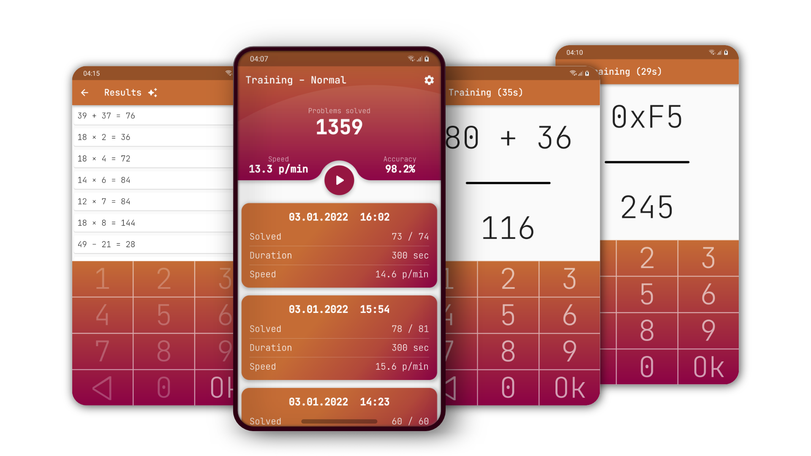

# Math Training app

A mobile application for training mental math skills.

The app has several different modes, including simple addition/subtraction training and and more tricky ones like converting hex numbers to decimal.

The app will save results of each training so you can track your progress.

You can try the online version out [here.](https://cifruktus.github.io/MathTrainingWebapp/#/)

## How to build

1. Generate icons:
`flutter pub run flutter_launcher_icons:main`

2. Build an application:
`flutter build apk`
